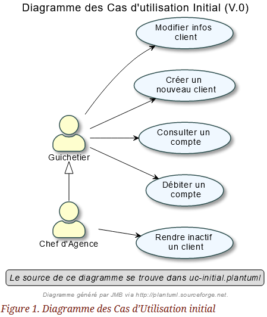
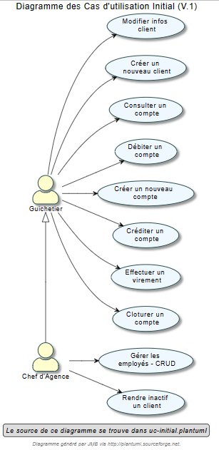
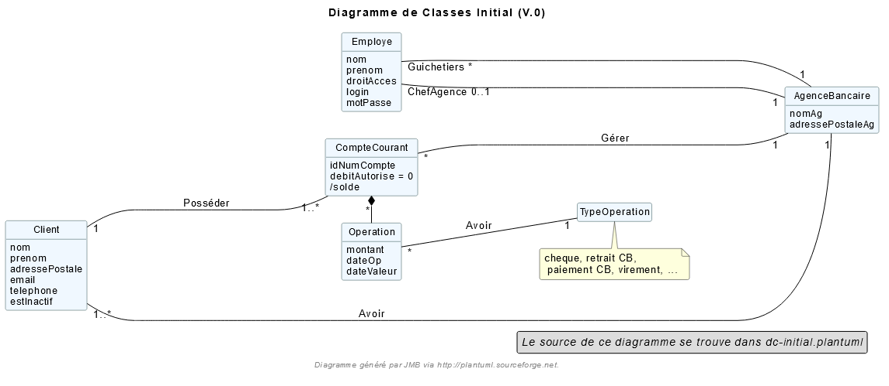
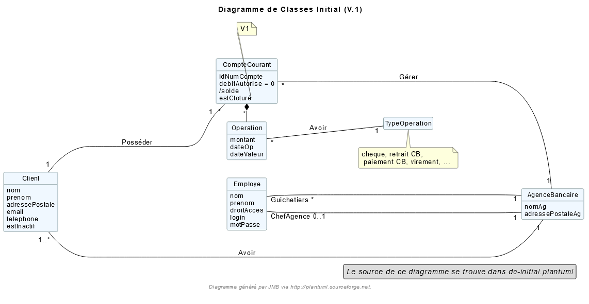

= DOCUMENTATION TECHNIQUE V1

Version 1 +

Date : 17 mai 2023 +

Equipe : BERNARD Julien, ESTRADE Prescilla, MALIQUE Manon +

Groupe 4A1

Projet : DailyBank - SAÉ 2.01 et 2.05

== Sommaire
* <<presentation_appli>>
** <<use_case>>
** <<diagramme_de_classe>>
* <<architecture>>
** <<architecture_generale>> 
** <<ressources_externes>> 
** <<structuration>> 
** <<elements_essentiels>> 
* <<presentation_des_diagrammes>>
** <<guichetier>>
*** <<crediter_compte>>
*** <<debiter_compte>>
*** <<creer_compte>>
*** <<virement_compte>>
*** <<cloturer_compte>>
** <<chef_agence>>
*** <<CRUD>>
**** <<create>>
**** <<read>>
**** <<update>>
**** <<delete>>

[[presentation_appli]]
== 1. Presentation de l'application
L’application DailyBank permet de gérer des comptes bancaires de dépôt pour des clients préalablement créés. Elle dispose de plusieurs fonctionnalités : débiter, créditer un compte, effectuer des virements, consulter un compte, le clôturer, simuler un emprunt ou encore générer un relevé mensuel.

[[use_case]]
=== 1.1 Use Case global

_Figure 2. Diagramme des Cas d’Utilisation (V.2)_ 

Nous identifions deux types d’utilisateurs de l’application : le guichetier et le chef d’agence.

Le guichetier peut créer un nouveau client, modifier ses informations, créer un compte, le consulter, le débiter, le créditer ou encore le clôturer. De plus, il peut effectuer un virement de compte à compte, générer un relevé mensuel d’un compte en PDF et gérer les prélèvements automatiques.
Le chef d’agence a les mêmes fonctionnalités que le guichetier et peut également rendre inactif un client, gérer les employés, effectuer un débit exceptionnel, simuler un emprunt et simuler une assurance d’emprunt.

[[diagramme_de_classe]]
=== 1.2 Diagramme de classe des données global

_Figure 3. Diagramme de Classes (V.0)_

_Figure 4. Diagramme de Classes (V.1)_

[[architecture]]
== 2. Architecture

[[architecture_generale]]
=== 2.1 Architecture générale

[[ressources_externes]]
=== 2.2 Ressources externes utilisées et rôles

* Le fichier .jar

[[structuration]] 
=== 2.3 Structuration en packages de l'application

* Application : 
** application : DailyBank : main() de départ
** application.control : 
** application.tools : 
** application.view : 
* Model : 
** model.data : 
** model.orm : 
** model.orm.exception : 

[[elements_essentiels]]
=== 2.4 Elements essentiels

[[presentation_des_diagrammes]]
== 3. Présentation et explication des diagrammes demandés

[[guichetier]]
=== 3.1 Guichetier

[[crediter_compte]]
==== 3.1.1 Créditer un compte - Prescilla

[[debiter_compte]]
==== 3.1.2 Débiter un compte - Prescilla

[[creer_compte]]
==== 3.1.3 Créer un compte - Julien

[[virement_compte]]
==== 3.1.4 Effectuer un virement de compte à compte - Julien

[[cloturer_compte]]
==== 3.1.5 Clôturer compte - Manon

[[chef_agence]]
=== 3.2 Chef d'agence

[[CRUD]]
==== 3.2.1 Gérer (faire le “CRUD”) les employés (guichetier et chef d’agence)

[[create]]
===== 3.2.1.1 Create - Manon

[[read]]
===== 3.2.1.2 Read - Manon

[[update]]
===== 3.2.1.3 Update - Prescilla

[[delete]]
===== 3.2.1.4 Delete - Julien

[[elements_code]]
== 4. Eléments de code significatifs commentés
