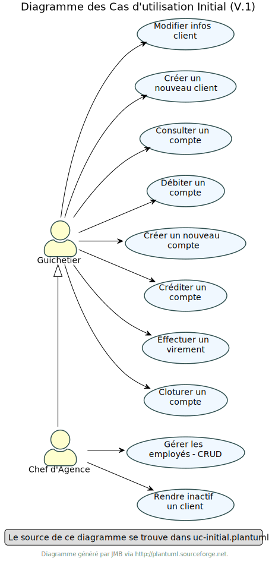
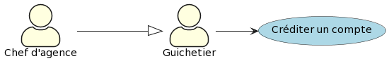
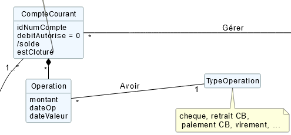
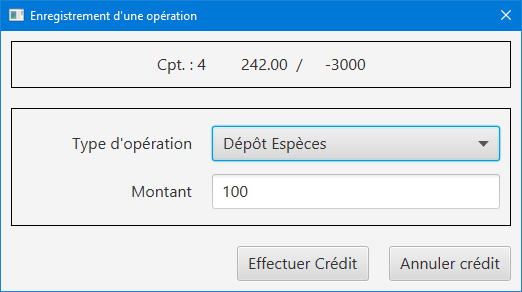
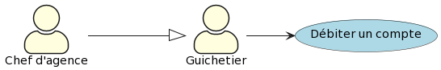
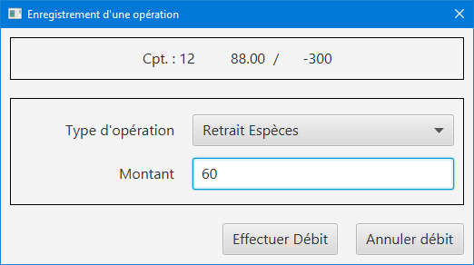
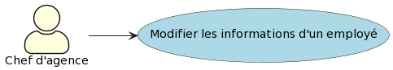
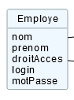

= DOCUMENTATION TECHNIQUE V1

Version 1 +

Date : 17 mai 2023 +

Equipe : BERNARD Julien, ESTRADE Prescilla, MALIQUE Manon +

Groupe 4A1

Projet : DailyBank - SAÉ 2.01 et 2.05

== Sommaire
* <<presentation_appli>>
** <<use_case>>
** <<diagramme_de_classe>>
* <<architecture>>
** <<architecture_generale>> 
** <<ressources_externes>> 
** <<structuration>> 
** <<elements_essentiels>> 
* <<presentation_des_diagrammes>>
** <<guichetier>>
*** <<crediter_compte>>
*** <<debiter_compte>>
*** <<creer_compte>>
*** <<virement_compte>>
*** <<cloturer_compte>>
** <<chef_agence>>
*** <<CRUD>>
**** <<create>>
**** <<read>>
**** <<update>>
**** <<delete>>

[[presentation_appli]]
== 1. Presentation de l'application
L’application DailyBank permet de gérer des comptes bancaires de dépôt pour des clients préalablement créés. Elle dispose de plusieurs fonctionnalités : débiter, créditer un compte, effectuer des virements, consulter un compte, le clôturer, simuler un emprunt ou encore générer un relevé mensuel.

[[use_case]]
=== 1.1 Use Case global

image::UseCaseV0.png[]

_Figure 2. Diagramme des Cas d’Utilisation (V.1)_ 

Nous identifions deux types d’utilisateurs de l’application : le guichetier et le chef d’agence.

Le guichetier peut créer un nouveau client, modifier ses informations, créer un compte, le consulter, le débiter, le créditer ou encore le clôturer. De plus, il peut effectuer un virement de compte à compte, générer un relevé mensuel d’un compte en PDF et gérer les prélèvements automatiques.
Le chef d’agence a les mêmes fonctionnalités que le guichetier et peut également rendre inactif un client, gérer les employés, effectuer un débit exceptionnel, simuler un emprunt et simuler une assurance d’emprunt.

[[diagramme_de_classe]]
=== 1.2 Diagramme de classe des données global

image::DiagrammeClassesV0.png[]
_Figure 3. Diagramme de Classes (V.0)_

Le diagramme de classes V0 dispose de plusieurs tables :

* Client : a un nom, un prénom, une adresse postale, un email, un numéro de téléphone et un statut estInactif (si un client est inactif ou non) +

* CompteCourant : possède un identifiant numéro compte, un débit autorisé et un solde

* Operation : dispose d’un montant, d’une date de début d’opération et d’une date de valeur +

* TypeOperation : représente un chèque, un retrait par carte bancaire, un paiement par carte bancaire ou encore un virement +

* AgenceBancaire : dispose d’un nom et d’une adresse postale +

* Employe : a un nom, un prénom, un droit d’accès, un login et un mot de passe +

image::DiagrammeClassesV1.png[]
_Figure 4. Diagramme de Classes (V.1)_

[[architecture]]
== 2. Architecture

[[architecture_generale]]
=== 2.1 Architecture générale

[[ressources_externes]]
=== 2.2 Ressources externes utilisées et rôles

* Le fichier .jar

[[structuration]] 
=== 2.3 Structuration en packages de l'application

* Application : 
** application : DailyBank : main() de départ
** application.control : Ce package est responsable de la gestion de la logique de contrôle de l'application. Il contient des classes ou des fonctions qui gèrent les interactions avec l'utilisateur, la validation des entrées et coordonnent la circulation des données au sein de l'application.
** application.tools : Le package application.tools fournit des fonctions utilitaires ou des classes couramment utilisées dans l'application. Ces outils aident à simplifier le développement et à améliorer l'organisation du code en fournissant des fonctionnalités réutilisables.
** application.view : Le package application.view se concentre sur les aspects de l'interface utilisateur (IU) de l'application.
* Model :
** model.data : Le package model.data sert à décrire les différents objets utilisés (AgenceBancaire, Client ,ect...). 
** model.orm : Le package model.orm est chargé de la gestion des données dans l'application. Ce package inclut des fonctions pour récupérer des données à partir d'une base de données, les sauvegarder ou effectuer des transformations de données.
** model.orm.exception : Le package model.orm.exception regroupe des exceptions qui sont utilisées pour gérer les erreurs liées aux opérations de base de données ou à la manipulation des données.

[[elements_essentiels]]
=== 2.4 Elements essentiels

[[presentation_des_diagrammes]]
== 3. Présentation et explication des diagrammes demandés

[[guichetier]]
=== 3.1 Guichetier
Le guichetier a accès à plusieurs fonctionnalités : créditer un compte, débiter un compte, créer un compte, effectuer un virement et clôturer un compte. 

[[crediter_compte]]
==== 3.1.1 Créditer un compte - Prescilla
Cette fonctionnalité permet de créditer un compte.

_Figure Diagramme des Cas d’Utilisation crediter compte(V.1)_ 

**Classes et ressources utilisées :** +
* OperationManagement.java : +
* OperationManagementController.java : +
* OperationManagement.fxml : +
* OperationEditorPaneController.java : +
* AccessOperation.java : +

_Figure Diagramme de classes crediter compte_ 

_Figure Interface crediter compte_ 

[[debiter_compte]]
==== 3.1.2 Débiter un compte - Prescilla
Cette fonctionnalité permet de débiter un compte.

_Figure Diagramme des Cas d’Utilisation debiter compte_ 

**Classes et ressources utilisées :**

_Figure Diagramme de classes debiter compte_ 

_Figure Interface debiter compte_ 

[[creer_compte]]
==== 3.1.3 Créer un compte - Julien

[[virement_compte]]
==== 3.1.4 Effectuer un virement de compte à compte - Julien

[[cloturer_compte]]
==== 3.1.5 Clôturer compte - Manon

[[chef_agence]]
=== 3.2 Chef d'agence
Le chef d'agence a pour fonctionnalités : gérer les employés qui sont le guichetier et le chef d'agence. C'est-à-dire gérer le CRUD : Créer un employé, Consulter un employé, Modifier les informations d'un employé et Supprimer un employé.

[[CRUD]]
==== 3.2.1 Gérer (faire le “CRUD”) les employés (guichetier et chef d’agence)

[[create]]
===== 3.2.1.1 Create - Manon

[[read]]
===== 3.2.1.2 Read - Manon

[[update]]
===== 3.2.1.3 Update - Prescilla
Cette fonctionnalité permet de modifier les informations d'un employé.

_Figure Diagramme des Cas d’Utilisation update employe_ 

**Classes et ressources utilisées :**

_Figure Diagramme de classes update employe_ 

[[delete]]
===== 3.2.1.4 Delete - Julien

[[elements_code]]
== 4. Eléments de code significatifs commentés
