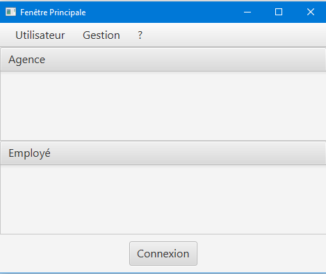
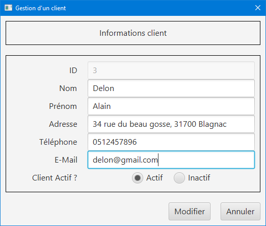
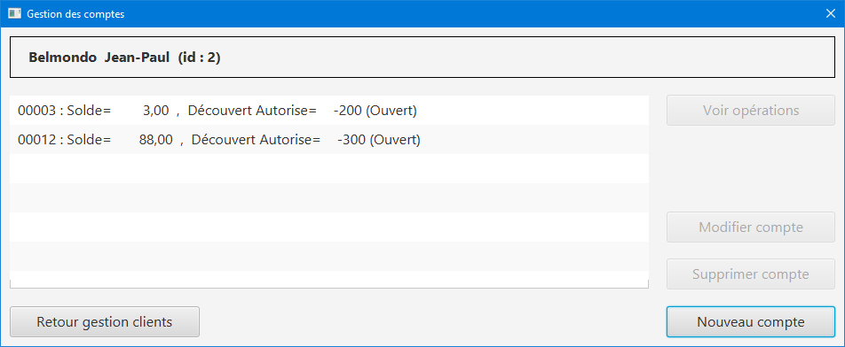
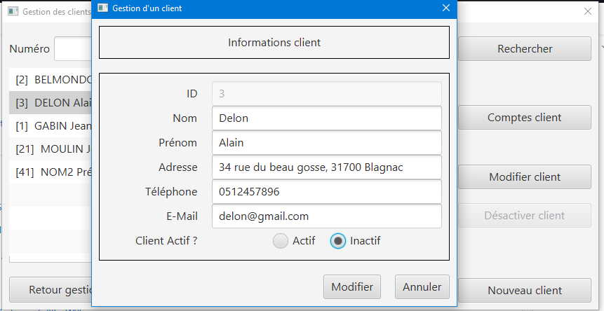
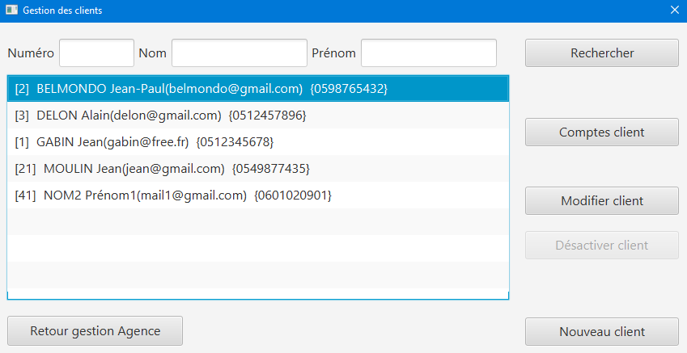
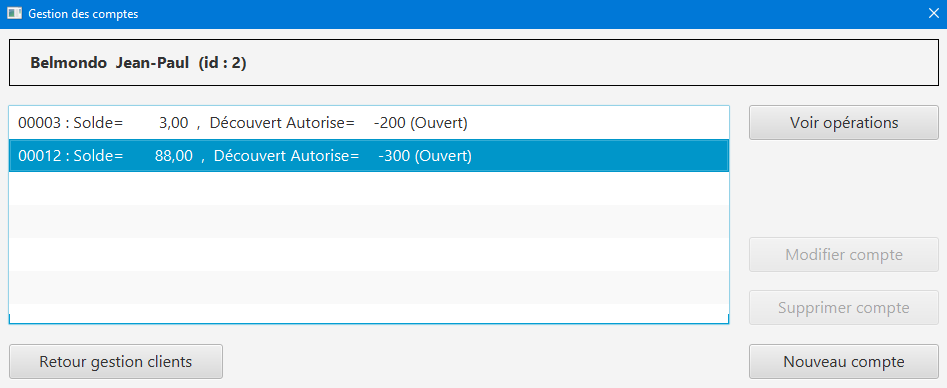

= DOCUMENTATION UTILISATEUR V1

Version 1 +

Date : 16 mai 2023 +

Equipe : BERNARD Julien, ESTRADE Prescilla, MALIQUE Manon +

Groupe 4A1

Projet : DailyBank - SAÉ 2.01 et 2.05

== Sommaire
* <<presentation>>
* <<installation_utilisation>>
* <<fonctionnementv0>>
** <<guichetierv0>>
*** <<Modifier_les_informations_des_clients>>
*** <<Créer_nouveau_client>>
*** <<Consulter_un_compte>>
*** <<Débiter_un_compte>>
** <<chef_agencev0>>
*** <<Rendre_inactif_un_client>>
* <<fonctionnementv1>>
** <<guichetierv1>>
*** <<crediter_compte>>
*** <<debiter_compte>>
*** <<creer_compte>>
*** <<virement_compte>>
*** <<cloturer_compte>>
** <<chef_agencev1>>
*** <<CRUD>>
**** <<create>>
**** <<read>>
**** <<update>>
**** <<delete>>
* <<resultats>> 

[[presentation]]
== 1. Presentation générale, rôle de l'application
L’application DailyBank permet de gérer des comptes bancaires de dépôt pour des clients préalablement créés. Elle dispose de plusieurs fonctionnalités : débiter, créditer un compte, effectuer des virements, consulter un compte, le clôturer, simuler un emprunt ou encore générer un relevé mensuel.

L’application dispose de deux types d’utilisateurs : le guichetier et le chef d’agence.

Le guichetier peut créer un nouveau client, modifier ses informations, créer un compte, le consulter, le débiter, le créditer ou encore le clôturer. De plus, il peut effectuer un virement de compte à compte, générer un relevé mensuel d’un compte en PDF et gérer les prélèvements automatiques.

Le chef d’agence a les mêmes fonctionnalités que le guichetier et peut également rendre inactif un client, gérer les employés, effectuer un débit exceptionnel, simuler un emprunt et simuler une assurance d’emprunt.

[[installation_utilisation]]
== 2. Installation utilisation

Il est nécessaire d'avoir Java 1.8 installé.

Afin d’utiliser le programme de la banque, il est téléchargable et exécutable pour les employés de la banques ainsi que les chefs d’agence afin de gérer toutes les données, comptes et informations de la banque.

Un jar file sera trouvable pour les utilisateurs et l’exécuter ouvrira une fenêtre d’accueil dont une connexion est demandée systématiquement avant de continuer.

Les utilisateurs peuvent désormais utiliser l’application et chacune des opérations et possibilités sont expliquées dans le document utilisateur ci-dessous.

[[fonctionnementv0]]
== 3. Fonctionnement de la V0

[[guichetierv0]]
=== 3.1 Guichetier
Le guichetier a accès à plusieurs fonctionnalités : modifier les informations des clients, créer un nouveau client, consulter un compte et débiter un compte. 

[[Modifier_les_informations_des_clients]]
==== 3.1.1 Modifier informations clients

Pour modifier les informations d'un client, le guichetier doit se connecter à l'application. Puis cliquer sur Gestion et sélectionner Clients. Ensuite, il faut cliquer sur Rechercher puis choisir le client dont l'on souhaite modifier ses informations. Par la suite, l'on sélectionne Modifier client, l'on modifie les informations et valide en cliquant sur le bouton Modifier.

[[Créer_nouveau_client]]
==== 3.1.2 Créer nouveau client
Le guichetier a la possibilité de créer un compte d'informations d'un client afin qu'il puisse être reconnu par la banque et avoir un compte bancaire.
Pour créer un compte client, il est nécessaire de se connecter en tant que Guichetier.

image::Images/Connexion.png[]

Après s'être connecté, nous devons cliquer sur Gestion/Clients, cela ouvre une nouvelle fenêtre dont recherche de clients, en bas à droite se trouve le bouton nous permettant de créer un compte client, on renseigne toutes  les informations nécessaires.

image::Images/creer_compte.png[]

Une fois cliqué sur Ajouter, le compte client est enregistré dans la base de données est peut désormais posséder un compte bancaire en demandant à un guichetier.

[[Consulter_un_compte]]
==== 3.1.2 Consulter un compte

Afin de consulter un compte, il faut se connecter à l'application en tant que guichetier. Puis cliquer sur Gestion et sélectionner Clients. Après, il faut cliquer sur Rechercher puis choisir un client. Par la suite, l'on sélectionne Comptes client qui ouvre une fenêtre affichant les comptes du client.

On sélectionne ensuite le compte voulu et en appuyant sur le bouton Voir opérations toutes les opérations effectuées sur le compte s'affichent.

image::Images/consulter_compte2.png[]

[[Débiter_un_compte]]
==== 3.1.2 Débiter un compte (BD)
Pour débiter un compte, il faut se connecter à l’application en tant que guichetier. Dans une nouvelle fenêtre, il faut cliquer sur Gestion puis sur Clients. On accéde ainsi aux comptes clients à l’aide du bouton Comptes client. Dans cette nouvelle fênetre, on clique sur le bouton Voir opérations qui affiche l’historique des opérations. Par la suite, l’on clique sur Enregistrer Crédit, une fenêtre s'affiche et il faut entrer le montant à déposer et choisir le type d’opération : dépôt espèces ou dépôt chèque. 

Pour valider le crédit ou l’annuler, il faut choisir soit le bouton EffectuerDébit ou le bouton Annuler débit.

image::Images/debiter_compte.png[]

[[chef_agencev0]]
=== 3.2 Chef_agence

Le chef d'agence a la possibilité de rendre inactif un client.

[[Rendre_inactif_un_client]]
==== 3.2.1 Rendre inactif un client
Afin de désactiver un compte client, il est nécessaire de se connecter en tant que Chef d’Agence, une fois fait, il faut se rendre sur la gestion des clients et de cliquer sur le bouton « modifier client »

On coche « inactif », ce qui permet de désactiver toute opération sur le compte par un Guichetier, un chef d’agence pour retourner à tout moment sur son choix pour remettre le compte client actif

[[fonctionnementv1]]
== 4. Fonctionnement de la V1

[[guichetierv1]]
=== 4.1 Guichetier

Le guichetier a accès à plusieurs fonctionnalités : créditer un compte, débiter un compte, créer un compte, effectuer un virement et clôturer un compte. 

[[crediter_compte]]
==== 4.1.1 Créditer un compte - Prescilla

Pour créditer un compte, il faut se connecter en tant que guichetier. Ensuite, il faut cliquer sur Gestion et choisir Clients. Une fenêtre s’affiche et l’on peut accéder aux comptes clients à l’aide du bouton Comptes client. Dans cette nouvelle fênetre, en cliquant sur le bouton Voir opérations cela affiche l’historique des opérations et il faut cliquer sur Enregistrer Crédit. 

En cliquant sur le bouton Enregistrer Crédit il faut entrer le montant à déposer et choisir le type d’opération : dépôt espèces ou dépôt chèque. 

Enfin, à l’aide du bouton EffectuerDébit l’on peut valider le crédit et en cliquant sur Annuler débit cela annule le débit.

image::Images/crediter_compte.png[]

[[debiter_compte]]
==== 4.1.2 Débiter un compte - Prescilla

Afin de débiter un compte, il faut se connecter à l’application en tant que guichetier. Une nouvelle fenêtre s’affiche à l’écran, il faut cliquer sur Gestion puis sur Clients. Dès lors, l’on peut accéder aux comptes clients à l’aide du bouton Comptes client. Dans cette nouvelle fênetre, en cliquant sur le bouton Voir opérations, l’historique des opérations est affiché. L’on clique ensuite sur Enregistrer Crédit, une fenêtre s’affiche où il faut entrer le montant à déposer et choisir le type d’opération : dépôt espèces ou dépôt chèque. 

L’on peut valider le crédit ou l’annuler, en choisissant soit le bouton EffectuerDébit ou Annuler débit.

image::Images/debiter_compte.png[]

[[creer_compte]]
==== 4.1.3 Créer un compte - Julien
Pour créer un compte, il est nécessaire de se connecté en tant que Guichetier, il est aussi possible de le faire en étant chef d'agence.
Après s'être connecté, nous devons cliquer sur Gestion/Clients afin de rechercher le client que nous voulons créer de compte.

Une nouvelle fenêtre affiche les comptes bancaires du client.

En cliquant sur nouveau compte, cela fait apparaître une nouvelle fenêtre où nous pouvons renseigner toutes les informations nécessaires à la création du compte, le montant maximum du découvert (argent négatif sur le compte), si nous voulons ajouté un montant d'argent dès la création du compte, l'ID du Client, de l'agence et son numéro de compte est ajouté automatiquement.

image::Images/creer_compte_bancaire.png[]

Une fois validé, le compte bancaire du client est ajouté avec succès et est prêt à être utiliser pour divers opérations.

[[virement_compte]]
==== 4.1.4 Effectuer un virement de compte à compte - Julien
Le bouton du virement se situe en dessous pour effectuer le débit et crédit, une fois cliquer dessus il ouvre une toute nouvelle fenêtre permettant de faire un virement d'un même client entre deux de ses comptes.
Le montant choisi sera versé sur son second compte et retiré de son premier, bien sûr une exception est effectuée si le montant est plus grand que le solde actuel. 

_En cours de réalisation_

[[cloturer_compte]]
==== 4.1.5 Clôturer compte - Manon

_En cours de réalisation_

[[chef_agencev1]]
=== 4.2 Chef d'agence

Le chef d'agence a pour fonctionnalités : gérer les employés qui sont le guichetier et le chef d'agence. C'est-à-dire gérer le CRUD : Créer un employé, Consulter un employé, Modifier les informations d'un employé et Supprimer un employé.

[[CRUD]]
==== 4.2.1 Gérer (faire le “CRUD”) les employés (guichetier et chef d’agence)

[[create]]
===== 4.2.1.1 Create - Manon

_En cours de réalisation_

[[read]]
===== 4.2.1.2 Read - Manon

_En cours de réalisation_

[[update]]
===== 4.2.1.3 Update - Prescilla
Cette fonctionnalité permet de modifier les employés : guichetier et chef d'agence. Pour cela, il faut se connecter en tant que chef d'agence puis cliquer sur le bouton Gestion et choisir Employés. Une nouvelle fenêtre s'ouvre et affiche les employés. 
Ensuite, il faut sélectionner un employé puis cliquer sur le bouton Modifier employés. Dès lors, l'on peut modifier les informations de l'employé (nom, prénom, adresse, téléphone, e-mail). Pour valider ces modifications, l'on doit cliquer sur Modifier. 

_En cours de réalisation_

[[delete]]
===== 4.2.1.4 Delete - Julien
La possiblité de supprimer un compte bancaire d'un client en appuyant sur le bouton nécessaire, cela affichera un avertissement afin de confirmer l'action.

_En cours de réalisation_

[[resultats]]
== 5. Résultats produits avec jeux d'essai

_En cours de réalisation_
