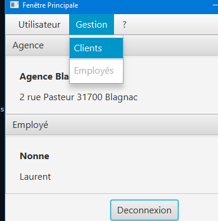
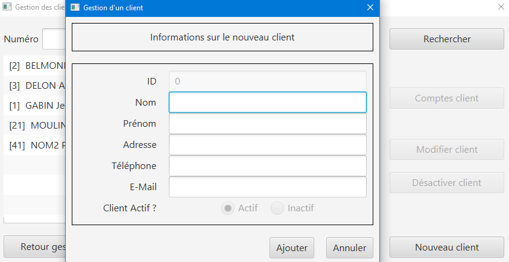

= DOCUMENTATION UTILISATEUR V1

Version 1 +

Date : 16 mai 2023 +

Equipe : BERNARD Julien, ESTRADE Prescilla, MALIQUE Manon +

Groupe 4A1

Projet : DailyBank - SAÉ 2.01 et 2.05

== Sommaire
* <<presentation>>
* <<installation_utilisation>>
* <<fonctionnementv0>>
** <<guichetierv0>>
*** <<Modifier_les_informations_des_clients>>
*** <<Créer_nouveau_client>>
*** <<Consulter_un_compte>>
*** <<Débiter_un_compte>>
** <<chef_agencev0>>
*** <<Rendre_inactif_un_client>>
* <<fonctionnementv1>>
** <<guichetierv1>>
*** <<crediter_compte>>
*** <<debiter_compte>>
*** <<creer_compte>>
*** <<virement_compte>>
*** <<cloturer_compte>>
** <<chef_agencev1>>
*** <<CRUD>>
**** <<create>>
**** <<read>>
**** <<update>>
**** <<delete>>
* <<resultats>> 

[[presentation]]
== 1. Presentation générale, rôle de l'application
L’application DailyBank permet de gérer des comptes bancaires de dépôt pour des clients préalablement créés. Elle dispose de plusieurs fonctionnalités : débiter, créditer un compte, effectuer des virements, consulter un compte, le clôturer, simuler un emprunt ou encore générer un relevé mensuel.

L’application dispose de deux types d’utilisateurs : le guichetier et le chef d’agence.

Le guichetier peut créer un nouveau client, modifier ses informations, créer un compte, le consulter, le débiter, le créditer ou encore le clôturer. De plus, il peut effectuer un virement de compte à compte, générer un relevé mensuel d’un compte en PDF et gérer les prélèvements automatiques.

Le chef d’agence a les mêmes fonctionnalités que le guichetier et peut également rendre inactif un client, gérer les employés, effectuer un débit exceptionnel, simuler un emprunt et simuler une assurance d’emprunt.

[[installation_utilisation]]
== 2. Installation utilisation

[[fonctionnementv0]]
== 3. Fonctionnement de la V0

[[guichetierv0]]
=== 3.1 Guichetier

[[Modifier_les_informations_des_clients]]
==== 3.1.1 Modifier informations clients

[[Créer_nouveau_client]]
==== 3.1.2 Créer nouveau client
Le guichetier a la possibilité de créer un compte d'informations d'un client afin qu'il puisse être reconnu par la banque et avoir un compte bancaire.

[[Consulter_un_compte]]
==== 3.1.2 Consulter un compte

[[Débiter_un_compte]]
==== 3.1.2 Débiter un compte (BD)

[[chef_agencev0]]
=== 3.2 Chef_agence

[[Rendre_inactif_un_client]]
==== 3.2.1 Rendre inactif un client

[[fonctionnementv1]]
== 4. Fonctionnement de la V1

[[guichetierv1]]
=== 4.1 Guichetier

[[crediter_compte]]
==== 4.1.1 Créditer un compte - Prescilla

[[debiter_compte]]
==== 4.1.2 Débiter un compte - Prescilla

[[creer_compte]]
==== 4.1.3 Créer un compte - Julien
Pour créer un compte, il est nécessaire de se connecté en tant que Guichetier, il est aussi possible de le faire en étant chef d'agence.
Après s'être connecté, nous devons cliquer sur Gestion/Clients afin de rechercher le client que nous voulons créer de compte.

En cliquant sur nouveau compte, cela fait apparaître une nouvelle fenêtre où nous pouvons renseigner toutes les informations nécessaires à la création du compte, le montant maximum du découvert (argent négatif sur le compte), si nous voulons ajouté un montant d'argent dès la création du compte, l'ID du Client, de l'agence et son numéro de compte sont ajouté automatiquement.

Une fois validé, le compte bancaire du client est ajouté avec succès et est prêt à être utiliser pour divers opérations.

[[virement_compte]]
==== 4.1.4 Effectuer un virement de compte à compte - Julien
Le bouton du virement se situe en dessous pour effectuer le débit et crédit, une fois cliquer dessus il ouvre une toute nouvelle fenêtre permettant de faire un virement d'un même client entre deux de ses comptes.
Le montant choisis sera versé sur son second compte et retiré de son premier, bien sûr une exception est effectué si le montant est plus grand que le solde actuel. 

[[cloturer_compte]]
==== 4.1.5 Clôturer compte - Manon

[[chef_agencev1]]
=== 4.2 Chef d'agence

[[CRUD]]
==== 4.2.1 Gérer (faire le “CRUD”) les employés (guichetier et chef d’agence)

[[create]]
===== 4.2.1.1 Create - Manon

[[read]]
===== 4.2.1.2 Read - Manon

[[update]]
===== 4.2.1.3 Update - Prescilla

[[delete]]
===== 4.2.1.4 Delete - Julien
La possiblité de supprimer un compte bancaire d'un client en appuyant sur le bouton nécessaire, cela affichera un avertissement afin de confirmer l'action.

[[resultats]]
== 5. Résultats produits avec jeux d'essai
