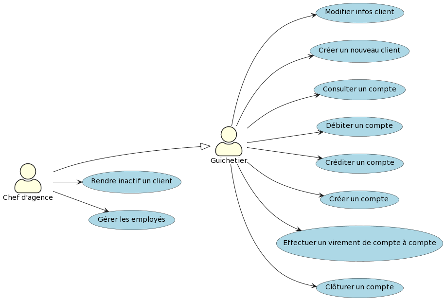

= CAHIER DES CHARGES V2

Version 2 +

Date : 16 mai 2023 +

Equipe : BERNARD Julien, ESTRADE Prescilla, MALIQUE Manon +

Groupe 4A1

Projet : DailyBank - SAÉ 2.01 et 2.05

== Sommaire
* <<presentation_sujet>>
** <<contexte>>
** <<objectif>>
** <<identification_utilisateurs>>
* <<analyse_existant>> 
* <<analyse_besoins>> 
** <<version1>>
* <<livrables>> 
* <<analyse_contraintes>> 
** <<techniques>>
** <<organisationnelles>>

[[presentation_sujet]]
== 1. Presentation du sujet

[[contexte]]
=== 1.1 Contexte
Le contexte bancaire est marqué par la nécessité pour les banques de répondre aux exigences des clients en termes de rapidité et de digitalisation. 

La banque DailyBank souhaite développer une application JAVA-Oracle de gestion des comptes clients pour remplacer plusieurs outils obsolètes. Ce développement s’inscrit dans le cadre de la restructuration de ses services bancaires et l’application sera déployée dans les 100 agences que compte son réseau. 
[[objectif]]
=== 1.2 Objectif
Nous travaillerons à partir d’une application existante « Daily Bank » qu’il faudra adapter aux nouveaux besoins de la banque. Nous réaliserons une première version puis une deuxième version de l’application. La banque, à travers cette application veut moderniser ses outils et services bancaires. 
[[identification_utilisateurs]]
=== 1.3 Identification des utilisateurs
L’application s’adresse a deux types d’utilisateurs : le guichetier et le chef d’agence. Le rôle du guichetier est de pouvoir créer un compte, le clôturer, le créditer, le débiter et effectuer un virement d’un compte à un autre. Quant au chef d’agence, il a pour rôle de gérer les employés.

[[analyse_existant]]
== 2. Analyse de l’existant
=== Un guichetier peut :
* Modifier informations client (adresse, téléphone, …)
* Créer un nouveau client
* Consulter un compte
* Débiter un compte (BD) 

=== Un chef d’agence peut :
* Rendre inactif un client

image::UseCaseV0.png[]

[[analyse_besoins]]
== 3. Analyse des besoins
L’application doit permettre de gérer des comptes bancaires de dépôt pour des clients préalablement créés. Elle devra permettre de débiter, créditer un compte soit par virement c’est à dire un échange d’argent entre deux comptes distincts mais domiciliés dans le réseau bancaire, soit par une personne physique se présentant devant un guichet.

[[version1]]
==== Version 1
* Ce que doit pouvoir faire un Guichetier :
** Créditer/débiter un compte (java et BD avec procédure stockée)
** Créer un compte
** Effectuer un virement de compte à compte
** Clôturer un compte
* Ce que doit pouvoir faire un Chef d’Agence :
** Gérer (faire le « CRUD ») les employés (guichetier et chef d’agence)

_CRUD : Create Read Update Delete_ 

 
_Figure 2. Diagramme des Cas d’Utilisation (V.1)_ 

[[livrables]]
== 4. Livrables
* Cahier des charges en AsciiDoc
* Gantt en pdf
* Documentation utilisateur
* Documentation technique
* Cahier de tests
* Application

[[analyse_contraintes]]
== 5. Analyse des contraintes

[[techniques]]
=== 5.1 Techniques
* Ressources : 
** Outils de développement : 
*** Java avec IHM (FX) IDE Eclipse
*** BD : Oracle Sql Developer
** Outil pour le Gantt : GanttProject
** Outil pour les diagrammes UML : PlantUML
** Outil pour les documentations : AsciiDoc
* Objectif : Application bancaire permettant de gérer des comptes bancaires de dépôt. Elle devra permettre de créer un compte, le débiter, le créditer un compte, d'effectuer un virement de compte à compte, de clôturer un compte et de gérer les employés (CRUD).

[[organisationnelles]]
=== 5.2 Organisationnelles
* Outils de travail collaboratifs : 
** Github pour la gestion du projet (codes, documentations...)
** Discord pour la communication de l’équipe
* Délais : +
** Vendredi 12 mai 12h : 
*** V1 du gantt
*** V1 du cahier des charges
** Mardi 16 mai 17h :
*** V1 de la documentation utilisateur
*** V2 du cahier des charges
*** V2 du gantt
** Mercredi 17 mai :
*** V1 de la documentation technique
*** V1 du cahier des tests
*** V1 de l’application
** Vendredi 26 mai :
*** V2 de la documentation utilisateur
*** Chiffrage projet
*** V2 de la documentation technique
*** V2 du cahier des tests et recette finale
*** V2 de l’application
** Semaines 22-23 :
*** Soutenance orale
*** Évaluation individuelle
* Mode de fonctionnement de l’équipe : +
Nous réalisons des réunions régulièrement pour suivre l'avancement du projet. +
Nous nous sommes répartis les tâches à réaliser de la façon suivante :

[options="header,footer"]
|=======================
|Tâche|BERNARD Julien | ESTRADE Prescilla | MALIQUE Manon
|Gantt    | X |  |
|Cahier des charges    |  | X | X
|Documentation utilisateur    | X | X | X
|Cahier des tests    | X | X | X
|Chiffrage projet   | X | X | X
|Application    | V1 : +
                  - Gérer (faire le « CRUD ») les employés (guichetier et chef d’agence) : DELETE +
                  - Créer un compte +
                  - Effectuer un virement de compte à compte + 
                  V2 : + 
                  - Gérer (faire le «CRUD[2]») les prélèvements automatiques +
                | V1 : +
                  - Créditer/débiter un compte (java et BD avec procédure stockée) +
                  - Gérer (faire le « CRUD ») les employés (guichetier et chef d’agence) : UPDATE +
                  V2 : +
                  - Effectuer un Débit exceptionnel +
                  - Simuler une assurance d’emprunt +
                | V1 : +
                  - Clôturer un compte +
                  - Gérer (faire le « CRUD ») les employés (guichetier et chef d’agence) : CREATE et READ +
                  V2 : +
			            - Simuler un emprunt +
                  - Générer un relevé mensuel d’un compte en PDF +
|=======================
