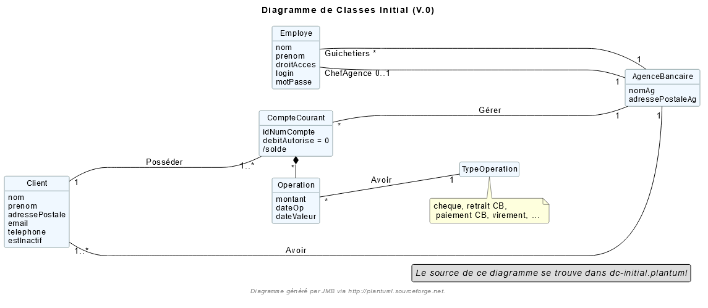
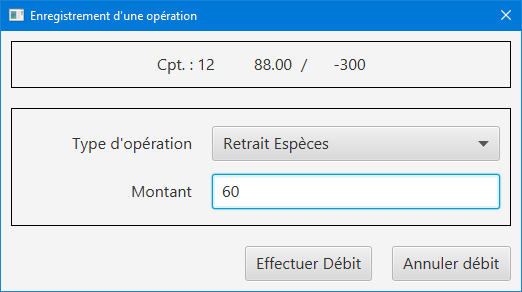
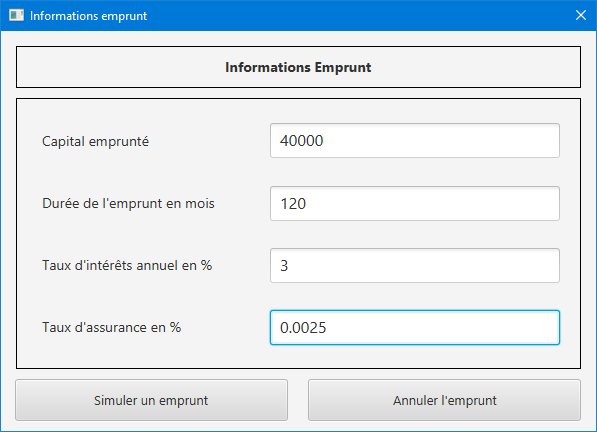
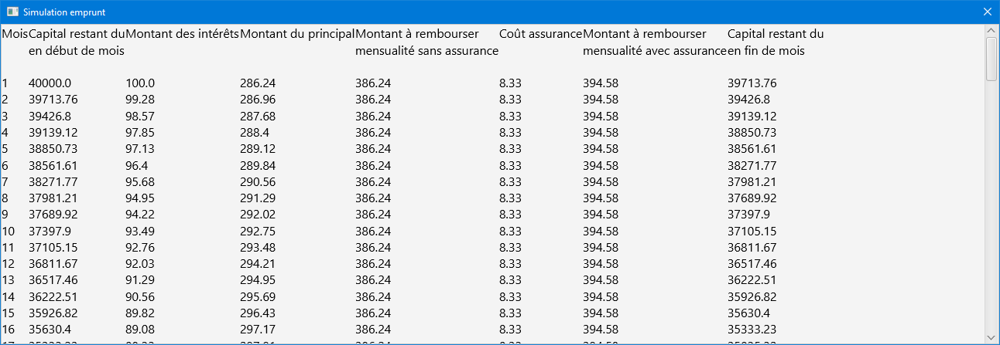

= DOCUMENTATION TECHNIQUE V2

Version 2 +

Date : 26 mai 2023 +

Equipe : BERNARD Julien, ESTRADE Prescilla, MALIQUE Manon +

Groupe 4A1

Projet : DailyBank - SAÉ 2.01 et 2.05

== Sommaire
* <<presentation_appli>>
** <<use_case>>
** <<diagramme_de_classe>>
** <<installation>>
* <<architecture>>
** <<architecture_generale>> 
** <<ressources_externes>> 
** <<structuration>> 
** <<elements_essentiels>> 
* <<version1_presentation_des_diagrammes>>
** <<guichetier>>
*** <<crediter_compte>>
*** <<debiter_compte>>
*** <<creer_compte>>
*** <<virement_compte>>
*** <<cloturer_compte>>
** <<chef_agence>>
*** <<CRUD>>
**** <<create>>
**** <<read>>
**** <<update>>
**** <<delete>>
* <<version2_presentation_des_diagrammes>>
** <<guichetierv2>>
*** <<releve_compte_PDF>>
*** <<crud_prelevements_automatiques>>
**** <<create_prelevements>>
**** <<read_prelevements>>
**** <<update_prelevements>>
**** <<delete_prelevements>>
** <<chef_agencev2>>
*** <<debit_exceptionnel>>
*** <<simuler_emprunt_assurance>>
* <<version3_presentation_des_diagrammes>>
** <<batch>>
*** <<generer_releves_mensuels>>
*** <<executer_prelevements_automatiques>>

[[presentation_appli]]
== 1. Presentation de l'application
L’application DailyBank permet de gérer des comptes bancaires de dépôt pour des clients préalablement créés. Elle dispose de plusieurs fonctionnalités : débiter, créditer un compte, effectuer des virements, consulter un compte, le clôturer, simuler un emprunt ou encore générer un relevé mensuel.

[[use_case]]
=== 1.1 Use Case global

image::Images/UseCaseV0.png[]

Nous identifions deux types d’utilisateurs de l’application : le guichetier et le chef d’agence.

Le guichetier peut créer un nouveau client, modifier ses informations, le consulter et le débiter. 
Le chef d’agence a les mêmes fonctionnalités que le guichetier et peut également rendre inactif un client.

image::Images/uc-initialv1.svg[]
_Figure 2. Diagramme des Cas d’Utilisation (V.1)_ 

En plus de la version 0, le guichetier peut créer un compte, le clôturer, le créditer et effectuer un virement. Le chef d’agence peut gérer les employés.

image::Images/uc-initialv2.svg[]
_Figure 3. Diagramme des Cas d’Utilisation (V.2)_ 

Dans cette nouvelle version, le guichetier peut générer un relevé mensuel en PDF et gérer les prélévements automatiques (CRUD). 
Le chef d'agence a de nouvelles fonctionnalités possibles : effectuer un débit exceptionnel, simuler un emprunt et simuler une assurance d'emprunt.

[[diagramme_de_classe]]
=== 1.2 Diagramme de classe des données global

_Figure 4. Diagramme de Classes (V.0)_

Le diagramme de classes V0 dispose de plusieurs tables :

* Client : a un nom, un prénom, une adresse postale, un email, un numéro de téléphone et un statut estInactif (si un client est inactif ou non) +

* CompteCourant : possède un identifiant numéro compte, un débit autorisé et un solde

* Operation : dispose d’un montant, d’une date de début d’opération et d’une date de valeur +

* TypeOperation : représente un chèque, un retrait par carte bancaire, un paiement par carte bancaire ou encore un virement +

* AgenceBancaire : dispose d’un nom et d’une adresse postale +

* Employe : a un nom, un prénom, un droit d’accès, un login et un mot de passe +

image::Images/DiagrammeClassesV1.png[]
_Figure 5. Diagramme de Classes (V.1)_

Le diagramme de classes V1 dispose des mêmes tables que dans la V0.
Il n'y a presque aucun changement à part qu'un SoldeCourant peut-être cloturé ou non.

image::Images/dc-initialv2.svg[]
_Figure 6. Diagramme de Classes (V.2)_

Le diagramme de classes V2 dispose de nouvelles tables :

* PrelevementAutomatique : a un montant, une date reccurente et un bénéficiaire

* Emprunt : possède un taux d'emprunt, un capital d'emprunt, une durée d'emprunt et une date de début d'emprunt

* AssuranceEmprunt : a un taux d'assurance et un taux de couverture

[[installation]]
=== 1.3 Installation de l'application

L'application fonctionne sous Java 17, la Base de données fonctionne sous Oracle.

Afin d'installer l'application pour l'utiliser, il est nécessaire de le télécharger à cet endroit précis : https://github.com/IUT-Blagnac/sae2023-bank-4a1/blob/Julien_V1/V1/target/DailyBank-1.0-shaded.jar.
Il n'est pas nécessaire d'avoir un autre logiciel ou driver pour que le Jar fonctionne

Une fois téléchargé, double cliquez dessus afin d'ouvrir l'application et de commencer à gérer la banque.

Il est possible de changer de base de données en modifiant des informations, afin de procéder aux changements, il faut ouvrir une application permettant de créer un fichier jar fonctionnel une fois que l'on aura effectué les changements, tel que Eclipse.
Une extraction du répertoire DailyBank afin d'en faire un workspace exploitable par Eclipse est suffisant. 
Le chemin du fichier qui nous intéresse est LogToDatabase.class, il se situe dans les répertoire model/orm.
Sur les deux lignes suivantes : 
private static final String user = "G4A1S2";
private static final String passwd = "aucuneidee";
 
Il faut changer le login (G4A1S2) et le mot de passe (aucuneidee) à ceux d'une autre base de donnée.
 
Une fois les changements enregistrés, il est nécessaire de générer à nouveau un jar file.
En haut à gauche de l'application, dans File/Export, sélectionner Jar, JAR File, sélectionner le workspace DailyBank ainsi qu'un emplacement à choisir pour son extraction.
 
Bravo, vous trouverez votre jar file et pouvez l'exécuter sur une nouvelle base de données.

[[architecture]]
== 2. Architecture

[[architecture_generale]]
=== 2.1 Architecture générale

image::Images/architecture.png[]

Deux types d'utilisateurs se connectent à l'application : le guichetier et le chef d'agence. L'application se connecte à une base de données (Oracle SQL Developper).

[[ressources_externes]]
=== 2.2 Ressources externes utilisées et rôles

* Le fichier .jar

[[structuration]] 
=== 2.3 Structuration en packages de l'application

* Application : 
** application : DailyBank : main() de départ
** application.control : Ce package est responsable de la gestion de la logique de contrôle de l'application. Il contient des classes ou des fonctions qui gèrent les interactions avec l'utilisateur, la validation des entrées et coordonnent la circulation des données au sein de l'application.
** application.tools : Le package application.tools fournit des fonctions utilitaires ou des classes couramment utilisées dans l'application. Ces outils aident à simplifier le développement et à améliorer l'organisation du code en fournissant des fonctionnalités réutilisables.
** application.view : Le package application.view se concentre sur les aspects de l'interface utilisateur (IU) de l'application.
* Model :
** model.data : Le package model.data sert à décrire les différents objets utilisés (AgenceBancaire, Client ,ect...). 
** model.orm : Le package model.orm est chargé de la gestion des données dans l'application. Ce package inclut des fonctions pour récupérer des données à partir d'une base de données, les sauvegarder ou effectuer des transformations de données.
** model.orm.exception : Le package model.orm.exception regroupe des exceptions qui sont utilisées pour gérer les erreurs liées aux opérations de base de données ou à la manipulation des données.

DailyBankState.java permet de savoir si la personne connecté à l'application est un guichetier ou un chef d'agence, cela permet d'accéder à certains options selon le rôle de la personne comme par exemple seul le chef d'agence peut gérer les employés.

[[elements_essentiels]]
=== 2.4 Elements essentiels

Pour utiliser l'application il est nécessaire d'avoir Java 1.8. On exécute l'application en lançant le fichier .jar. Pour la base de données on utilise Oracle SQL Developper.

[[version1_presentation_des_diagrammes]]
== 3. Version 1 - Présentation et explication des diagrammes demandés

[[guichetier]]
=== 3.1.1 Guichetier
Le guichetier a accès à plusieurs fonctionnalités : créditer un compte, débiter un compte, créer un compte, effectuer un virement et clôturer un compte. 

[[crediter_compte]]
==== 3.1.1 Créditer un compte - Prescilla

image::Images/UseCase_crediter.png[]
_Figure Diagramme des Cas d’Utilisation crediter compte(V.1)_ 

**Classes et ressources utilisées :** 

* OperationsManagement.java : ajout méthode enregistrerCredit
* OperationManagementController.java : bouton btnCredit, méthode doCredit
* OperationManagement.fxml : Page FXML correspondant à la fenêtre "Gestion des opérations". Bouton pour enregistrer le crédit
* OperationEditorPaneController.java : +
- méthode displayDialog : case CREDIT affiche les informations du compte et modifie le texte des boutons btnOk et btnCancel par "Effectuer Crédit" et "Annuler crédit" +
- méthode doAjouter : case CREDIT vérifie les conditions lors d'un crédit +
* Access_BD_Operation.java : méthode insertCredit

_Figure Diagramme de classes crediter compte_ 

image::Images/crediter_compte.png[]
_Figure Interface crediter compte_ 

link:https://github.com/IUT-Blagnac/sae2023-bank-4a1/blob/main/V2/cahier%20de%20recette.adoc#crediter_compte[Fiche de tests créditer un compte]

[[debiter_compte]]
==== 3.1.2 Débiter un compte - Prescilla

image::Images/UseCase_debiter.png[]
_Figure Diagramme des Cas d’Utilisation debiter compte_ 

**Classes et ressources utilisées :** 

* OperationsManagement.java : méthode enregistrerDebit
* OperationManagementController.java : bouton btnDebit, méthode doDebit
* OperationManagement.fxml : Page FXML correspondant à la fenêtre "Gestion des opérations". Bouton pour enregistrer le débit
* OperationEditorPaneController.java : +
- méthode displayDialog : case DEBIT affiche les informations du compte et modifie le texte des boutons btnOk et btnCancel par "Effectuer Débit" et "Annuler débit" +
- méthode doAjouter : case DEBIT vérifie
 les conditions lors d'un débit +
* Access_BD_Operation.java : méthode insertDebit

_Figure Diagramme de classes debiter compte_ 

_Figure Interface debiter compte_ 

link:https://github.com/IUT-Blagnac/sae2023-bank-4a1/blob/main/V2/cahier%20de%20recette.adoc#debiter_compte[Fiche de tests débiter un compte]

[[creer_compte]]
==== 3.1.3 Créer un compte - Julien
C'est une fonctionnalité permettant de créer un compte Bancaire pour un client existant, une nouvelle fenêtre s'ouvrira affichant toutes les informations nécessaires à l'ajout du compte, le gérant de la création du compte en particulier le guichetier doit ajouter un solde de base sur le compte, les ID sont disposés automatiquement par le programme.
Une fois ajouté, le compte sera visible sur le gestionnaire des comptes du client.

**Classes et ressources utilisés :**

* ComptesManagementController.java : Controlleur de la fenêtre "Gestion des comptes". Les boutons "btnVoirOpes", "btnModifierCompte", "btnSupprCompte" sont nécessaires.
* ComptesManagement.java : Permet de gérer les comptes d’un client. Les méthodes suivantes sont utilisés, "getComptesDunClient", "creerNouveauCompte", "gererOperationsDUnCompte", "doComptesManagementDialog".
* Access_BD_CompteCourant.java : Permet de gérer l’accès aux comptes d’un client. Les méthodes "creerCompteCourant" et "updateCompteCourant".
* CompteEditorPane.fxml : Page FXML qui correspond à la fenêtre "Gestion des comptes".
* ComptesManagement.fxml : Page FXML qui correspond à la fenêtre "Gestion des clients".

[[virement_compte]]
==== 3.1.4 Effectuer un virement de compte à compte - Julien
L'opération de virement s'effectue en choisissant un compte bancaire client afin de faire un virement vers un autre compte du même client.

**Classes et ressources utilisés :**

* OperationEditorPane.java : Controlleur de la fenêtre "Gestion des comptes". Nous utilisons la même fenêtre que pour créditer et débiter.
* OperationManagement.java : Une nouvelle méthode "enregistrerVirement" est créer afin d'effectuer cette opération.
* Access_BD_Operation.java : Permet de gérer les différentes opérations des comptes. La méthode "insertVirement" a été créer.
* OperationEditorPaneController.java : Cette classe gère l'affichage des fenêtres selon l'opération qu'on choisit. +
Le switch case dans la méthode displayDialog permet de changer les textes selon l'opération, pour le cas d'un virement on affichage tous les comptes du client pour choisir le compte que l'on veut faire un virement. +
Le switch case dans la méthode doAjouter permet de vérifier les conditions lors de l'ajout des informations du virement lorsqu'on clique sur le bouton Ajouter.
* OperationManagementController.java : Cette classe effectue les opération sur le compte. La méthode "doAutre" étant vide, je l'ai complété pour le cas d'un virement.
* CategorieOperation.java : On ajoute l'opération possible d'un Virement. 
* OperationEditorPane.fxml : Page FXML qui correspond à la fenêtre "Enregistrement d'un virement". La fenêtre change dans le cas d'un virement.
* OperationManagement.fxml : Page FXML qui correspond à la fenêtre "Gestion des opérations". Ajout du bouton pour enregistrer un virement. 

[[cloturer_compte]]
==== 3.1.5 Clôturer compte - Manon

[[chef_agence]]
=== 3.2 Chef d'agence
Le chef d'agence a pour fonctionnalités : gérer les employés qui sont le guichetier et le chef d'agence. C'est-à-dire gérer le CRUD : Créer un employé, Consulter un employé, Modifier les informations d'un employé et Supprimer un employé.

[[CRUD]]
==== 3.2.1 Gérer (faire le “CRUD”) les employés (guichetier et chef d’agence)

[[create]]
===== 3.2.1.1 Create - Manon

[[read]]
===== 3.2.1.2 Read - Manon

[[update]]
===== 3.2.1.3 Update - Prescilla

image::Images/UseCase_update_employe.png[]
_Figure Diagramme des Cas d’Utilisation update employe_ 

**Classes et ressources utilisés :**

_Figure Diagramme de classes update employe_ 

link:https://github.com/IUT-Blagnac/sae2023-bank-4a1/blob/main/V2/cahier%20de%20recette.adoc#update_employe[Fiche de tests update employe]

[[delete]]
===== 3.2.1.4 Delete - Julien

[[version2_presentation_des_diagrammes]]
== 4. Version 2 - Présentation et explication des diagrammes demandés

[[guichetierv2]]
=== 4.1 Guichetier

Le guichetier a accès à plusieurs fonctionnalités : générer un relevé mensuel d'un compte en PDF et gérer les prélèvements automatiques. 

[[releve_compte_PDF]]
==== 4.1.1 Générer un relevé mensuel d'un compte en PDF - Manon

[[crud_prelevements_automatiques]]
=== 4.1.2 Gérer (faire le "CRUD") les prélèvements automatiques - Julien

[[create_prelevements]]
==== 4.1.2.1 Create

_Figure Diagramme des Cas d’Utilisation CRUD Prélèvements_ 

_Figure Diagramme de classes debiter compte_

**Classes et ressources utilisés :**

* ComptesManagement.java : Affiche les comptes du client. Nouvelle méthode "gererPrelevementDUnCompte" appelant la méthode "doPrelevementManagementDialog" afin d'afficher les informations nécessaires dans la fenêtre.
* PrelevementEditorPane.java : Nouvelle classe appelant la fenêtre nécessaire à l'ajout des informations du prélèvement.
* PrelevementManagement.java : Nouvelle classe apelant la fenêtre nécessaire pour voir les prélèvements sur le compte. +
Ici le bouton Nouveau est cliquer pour afficher une nouvelle fenêtre afin de remplir les informations souhaités, une fois confirmé, une méthode dans Access_BD_Prelevement est appelé pour ajouter le prélèvement à la base de donnée.
* ComptesManagementController.java : Affiche les comptes du client. +
Nouvelle méthode "doVoirPrelevement" pour afficher la fenêtre du prélèvement et nouveau bouton "btnPrel" pour accéder à la gestion des prélèvements.
* PrelevementEditorPaneController.java : Nouvelle classe modifiant le contenu de la fenêtre selon le cas dans "displayDialog", "isSaisieValide" regard quand on cliquer sur confirmer si les conditions sont remplis dans les trois zones de textes, le montant doit être positif (supérieur à 0), la date doit être un nombre entre 1 et 28, le bénéficiaire doit être inscrit même si il n'est pas nécessairement utile.
* Prelevement.data : Nouvelle classe, Toutes les informations nécessaires à propos d'un prélèvement, si les paramètres sont une chaîne de charactère ou un décimal.
* Access_BD_Prelevation.java : Nouvelle classe, Ajout le prélèvement dans la BD avec la méthode "insertPrelevement".
* prelevementeditorpane.fxml : Nouveau FXML de la fenêtre où on ajoute les informations du prélèvement.
* prelevementmanagement.fmxl : Nouveau FXML de la fenêtre montrant les prélèvements d'un compte.

[[read_prelevements]]
==== 4.1.2.2 Read

Simplement l'accès à la fenêtre de gestion des prélèvements du compte bancaire du client.

**Classes et ressources utilisés :**

* PrelevementEditorPane.java : Nouvelle classe appelant la fenêtre nécessaire à l'ajout des informations du prélèvement.
* PrelevementManagement.java : Nouvelle classe apelant la fenêtre nécessaire pour voir les prélèvements sur le compte. +
Ici le bouton Modifier est cliquer pour afficher une nouvelle fenêtre afin de remplir les informations souhaités, une fois confirmé, une méthode dans Access_BD_Prelevement est appelé pour modifier le prélèvement à la base de donnée.
* ComptesManagementController.java : Affiche les comptes du client. +
Nouvelle méthode "doVoirPrelevement" pour afficher la fenêtre du prélèvement et nouveau bouton "btnPrel" pour accéder à la gestion des prélèvements.
* PrelevementEditorPaneController.java : Nouvelle classe modifiant le contenu de la fenêtre selon le cas dans "displayDialog", "isSaisieValide" regard quand on cliquer sur confirmer si les conditions sont remplis dans les trois zones de textes, le montant doit être positif (supérieur à 0), la date doit être un nombre entre 1 et 28, le bénéficiaire doit être inscrit même si il n'est pas nécessairement utile.
* Prelevement.data : Nouvelle classe, Toutes les informations nécessaires à propos d'un prélèvement, si les paramètres sont une chaîne de charactère ou un décimal.
* prelevementeditorpane.fxml : Nouveau FXML de la fenêtre où on ajoute les informations du prélèvement.
* prelevementmanagement.fmxl : Nouveau FXML de la fenêtre montrant les prélèvements d'un compte.

[[update_prelevements]]
==== 4.1.2.3 Update

Modification du prélèvement en utilisant la même fenêtre que pour en créer une.

**Classes et ressources utilisés :**

* PrelevementEditorPane.java : Nouvelle classe appelant la fenêtre nécessaire à l'ajout des informations du prélèvement.
* PrelevementManagement.java : Nouvelle classe apelant la fenêtre nécessaire pour voir les prélèvements sur le compte. +
Ici le bouton Modifier est cliquer pour afficher une nouvelle fenêtre afin de remplir les informations souhaités, une fois confirmé, une méthode dans Access_BD_Prelevement est appelé pour modifier le prélèvement à la base de donnée.
* ComptesManagementController.java : Affiche les comptes du client. +
Nouvelle méthode "doVoirPrelevement" pour afficher la fenêtre du prélèvement et nouveau bouton "btnPrel" pour accéder à la gestion des prélèvements.
* PrelevementEditorPaneController.java : Nouvelle classe modifiant le contenu de la fenêtre selon le cas dans "displayDialog", "isSaisieValide" regard quand on cliquer sur confirmer si les conditions sont remplis dans les trois zones de textes, le montant doit être positif (supérieur à 0), la date doit être un nombre entre 1 et 28, le bénéficiaire doit être inscrit même si il n'est pas nécessairement utile.
* Prelevement.data : Nouvelle classe, Toutes les informations nécessaires à propos d'un prélèvement, si les paramètres sont une chaîne de charactère ou un décimal.
* Access_BD_Prelevation.java : Nouvelle classe, Modifie le prélèvement dans la BD avec la méthode "updatePrelevement".
* prelevementeditorpane.fxml : Nouveau FXML de la fenêtre où on ajoute les informations du prélèvement.
* prelevementmanagement.fmxl : Nouveau FXML de la fenêtre montrant les prélèvements d'un compte.

[[delete_prelevements]]
==== 4.1.2.4 Delete
Supprime le prélèvement d'un seul clique sur le bouton de la BD.

**Classes et ressources utilisés :**

* PrelevementEditorPane.java : Nouvelle classe appelant la fenêtre nécessaire à l'ajout des informations du prélèvement.
* PrelevementManagement.java : Nouvelle classe apelant la fenêtre nécessaire pour voir les prélèvements sur le compte. +
Ici le bouton Supprimer est cliquer pour qu'une méthode dans Access_BD_Prelevement est appelé pour modifier le prélèvement à la base de donnée.
* ComptesManagementController.java : Affiche les comptes du client. +
Nouvelle méthode "doVoirPrelevement" pour afficher la fenêtre du prélèvement et nouveau bouton "btnPrel" pour accéder à la gestion des prélèvements.
* PrelevementEditorPaneController.java : Nouvelle classe modifiant le contenu de la fenêtre selon le cas dans "displayDialog", "isSaisieValide" regard quand on cliquer sur confirmer si les conditions sont remplis dans les trois zones de textes, le montant doit être positif (supérieur à 0), la date doit être un nombre entre 1 et 28, le bénéficiaire doit être inscrit même si il n'est pas nécessairement utile.
* Prelevement.data : Nouvelle classe, Toutes les informations nécessaires à propos d'un prélèvement, si les paramètres sont une chaîne de charactère ou un décimal.
* Access_BD_Prelevation.java : Nouvelle classe, Supprime le prélèvement de la BD avec la méthode "supprimerPrelevement".
* prelevementeditorpane.fxml : Nouveau FXML de la fenêtre où on ajoute les informations du prélèvement.
* prelevementmanagement.fmxl : Nouveau FXML de la fenêtre montrant les prélèvements d'un compte.

[[chef_agencev2]]
=== 4.2 Chef d'agence

Le chef d'agence a pour fonctionnalités : effectuer un débit exceptionnel, simuler un emprunt et simuler une assurance d'emprunt.

[[debit_exceptionnel]]
==== 4.2.1 Effectuer un débit exceptionnel - Prescilla

_Figure Diagramme des Cas d’Utilisation débit exceptionnel_ 

**Classes et ressources utilisées :** 

* OperationsManagement.java  : ajout méthode enregistrerDebitExceptionnel
* OperationsManagementController.java : bouton btnDebitExceptionnel, méthode doDebitExceptionnel
* operationsmanagement.fxml : Page FXML correspondant à la fenêtre "Gestion des opérations". Ajout du bouton pour enregistrer un débit exceptionnel
* OperationEditorPaneController.java : +
- méthode displayDialog : ajout case DEBITEXCEPTIONNEL affiche les informations du compte et modifie le texte des boutons btnOk et btnCancel par "Effectuer Débit exceptionnel" et "Annuler débit exceptionnel" +
- méthode doAjouter : ajout case DEBITEXCEPTIONNEL vérifie les conditions lors d'un débit exceptionnel +
* Access_BD_Operation.java : ajout méthode insertDebitexceptionnel
* CategorieOperation.java : ajout opération Debit Exceptionnel
* ConstantesIHM.java : ajout operation Debit Exceptionnel
* scriptCreaBase.txt : procédure Debit_Exceptionnel

_Figure Diagramme de classes debit exceptionnel_ 

image::Images/debit_exceptionnel2.png[]
_Figure Interface debit exceptionnel_ 

link:https://github.com/IUT-Blagnac/sae2023-bank-4a1/blob/main/V2/cahier%20de%20recette.adoc#debit_exceptionnel[Fiche de tests débit exceptionnel]

[[simuler_emprunt_assurance]]
==== 4.2.2 Simuler un emprunt et une assurance d'emprunt - Prescilla

_Figure Diagramme des Cas d’Utilisation simuler un emprunt et assurance d'emprunt_ 

**Classes et ressources utilisées :** 

* Emprunt.java : Classant gérant l'affichage de la fenêtre d'informations d'un emprunt
* EmpruntController.java : Contrôleur de la fenêtre d'emprunt permettant la gestion des actions liées à la fenêtre d'emprunt
* emprunt.fxml : Page FXML correspondant à la fenêtre "Informations emprunt"
* SimulationEmprunt.java : Classe gérant l'affichage de la fenêtre de simulation d'emprunt
* SimulationEmpruntController.java :  Classe permettant la gestion de la fenêtre de simulation d'emprunt
* simulationemprunt.fxml : Page FXML correspondant à la fenêtre "Simulation emprunt"
* ClientsManagementController.java : ajout bouton btnEmprunt et méthode doEmprunt
* clientsmanagements.fxml : ajout du bouton SimulerEmprunt

_Figure Diagramme de classes simuler un emprunt et une assurance d'emprunt_ 

_Figure Interface Informations simuler un emprunt et une assurance d'emprunt_ 

_Figure Interface Résultat simulation d'un emprunt et d'une assurance d'emprunt_ 

link:https://github.com/IUT-Blagnac/sae2023-bank-4a1/blob/main/V2/cahier%20de%20recette.adoc#simuler_emprunt_assurance[Fiche de tests simuler un emprunt et une assurance d'emprunt]

[[version3_presentation_des_diagrammes]]
== 5. Version 3 - Présentation et explication des diagrammes demandés

[[batch]]
=== 5.1 Batch

[[generer_releves_mensuels]]
=== 5.1.1 Générer les relevés mensuels en PDF - Prescilla

[[executer_prelevements_automatiques]]
=== 5.1.2 Exécuter les prélèvements automatiques - Manon
